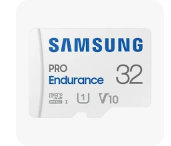
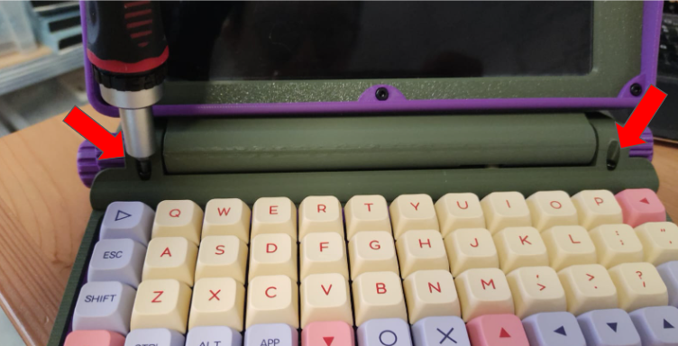
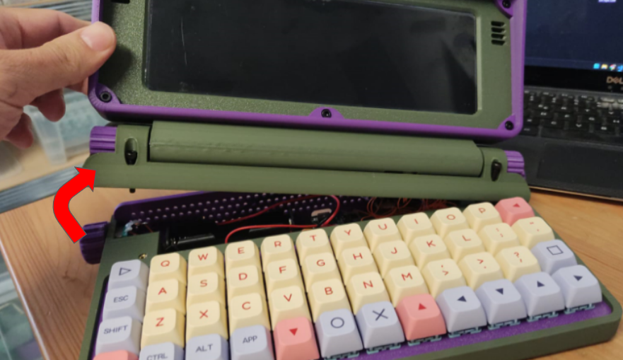
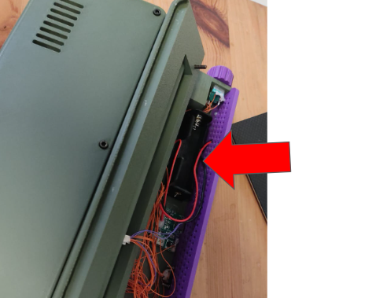
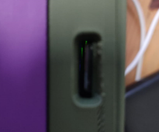
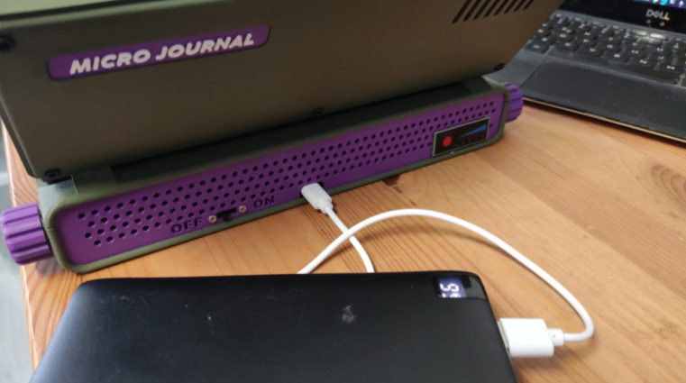
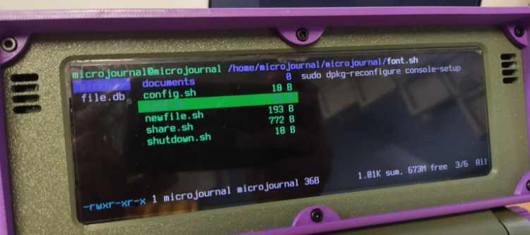
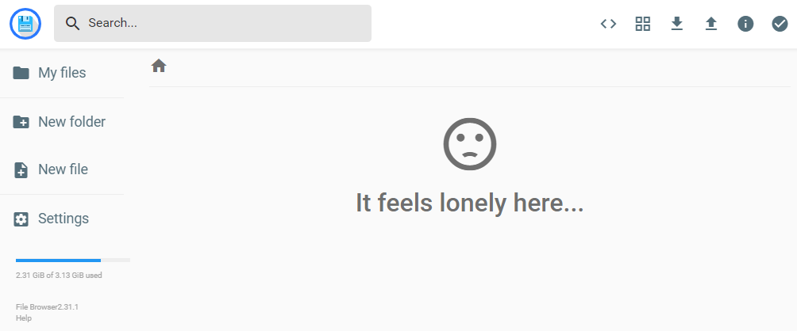

# Quick Start Guide - Micro Journal Rev.2.ReVamp


# First things to do

When you receive the **Micro Journal Rev.2**, you'll need to install a battery before using it. Please follow the steps below to complete the setup:

1. **Install the battery**: The **Rev.2.Revamp** will not function without a battery. Ensure the battery is properly installed before attempting to power it on.

2. **Power on**: Once the battery is installed, you're ready to power on and begin using your device.


# Battery Information


**Important: The Micro Journal Rev.2 requires a specific battery type, not AA or AAA batteries.**

Due to EU delivery restrictions, **the required battery is not included** in the package. To power your device, you will need to purchase an 18650 3.7V Lithium-ion battery separately. 

#### Battery Specifications:
- **Type:** 18650 Lithium-ion battery (3.7V)
- **Capacity:** Should not exceed 3300mAh

You can find 18650 batteries online or at most electronics retailers. **Both flat top and button top batteries are compatible,** though users report that flat tops may fit better.

#### Important Tips for Battery Selection:
- **Brand matters:** It is recommended to buy from a well-known, reputable brand.
- **Capacity limit:** Be cautious of any battery that claims a capacity higher than 3300mAh—batteries with higher capacities in this form factor do not exist.

Please make sure to install the battery correctly before powering on your Micro Journal Rev.2 for the first time.

**Battery Life:** The internal battery will typically provide **2 to 3 hours** of usage. For extended writing sessions, it's recommended to connect a **portable battery pack**. 
  - A **10,000 mAh power bank** will provide approximately **+10 hours** of usage. Every additional **1,000 mAh** translates to about **+1 hour** of writing time.


# Setup Micro SD Card

**Note: A pre-configured Micro SD card is included with the Micro Journal Rev.2. You do not need to buy or set it up. Refer to this guide only if you need to replace or reinstall the Micro SD card.**



The Micro Journal Rev.2 uses a Micro SD card for its Raspberry Pi Zero 2W computer. The card should have a capacity of **at least 4GB**. Using a faster card will improve boot times and overall performance.

While your Micro Journal Rev.2 ships with the Micro SD card already installed and configured, you may need to set up a new card in the future. For detailed instructions on how to do this, refer to the following guide:

[Raspberry Pi SD Card Setup How-To](./raspberrypi/readme.md)

Default configuration is designed to be user-friendly, allowing you to quickly get into writing mode without needing to learn complex Linux terminal commands.

# For Advanced Users

If you are familiar with Raspberry Pi configurations, feel free to customize the setup. The Micro Journal Rev.2 has no major constraints, though a minor display configuration may be necessary. Beyond that, you have the freedom to configure the Raspberry Pi as you prefer.


# First Setup

### Step 1. Open the Bottom Compartment and Install the Battery



1. **Unscrew the two screws** located on the bottom compartment. Carefully lift the display section and place it on top of the keyboard. Be gentle—there are thin wires connected to the display, and pulling too hard may disconnect them.





2. **Lift from the left-hand side** to reduce the risk of damaging the wires.


3. **Be mindful of the wire length.** If you lift the display higher than shown above, you may risk damaging the wires, potentially requiring basic soldering skills.





4. Once lifted, gently rest the display on top of the keyboard. You will now see the battery holder.

---

### Installing the Battery

1. **Check the battery polarity carefully.** The battery holder has markings for positive (+) and negative (-) polarity. The spring side of the holder is the negative (-) side. Incorrect polarity can cause irreversible damage to the device.

2. **Install the 18650 battery,** ensuring you follow the correct polarity as shown on the battery holder.

3. **Double-check the installation** to ensure the battery is properly seated and the polarity is correct.

---

### Important Notes:

- **Ensure the battery is fully charged** before use. LiPo batteries are not shipped fully charged. After installing the battery, connect the device to the charging port and leave it charging for at least 4 hours before first use.

- **Battery installation safety:** Improper handling or installation can cause a fire. Be cautious and avoid over-tightening the screws. If the case doesn’t close easily, check that no cables are pinched, as this could lead to short circuits, damage, or fire hazards.


### Step 2. Power On

**Battery Life:** The internal battery will typically provide **2 to 3 hours** of usage. For extended writing sessions, it's recommended to connect a **portable battery pack**. 
  - A **10,000 mAh power bank** will provide approximately **+10 hours** of usage. Every additional **1,000 mAh** translates to about **+1 hour** of writing time.


1. **Once the battery is fully charged,** flick the power switch to the "ON" position. It will take around **30 to 50 seconds** for the Micro Journal to fully boot up and be ready for use.

2. **Initial delay:** After switching it on, the screen may not immediately display anything. This is normal. It can take up to 30 seconds for the Raspberry Pi to recognize and activate the display.

3. **Check the SD card:** If the screen remains blank for too long, check for a green light near the micro SD card slot. This light indicates that the system is booting. If no green light appears, the SD card may not be properly installed. 



   - **Solution:** Power off, reinsert the SD card, and try again. If the issue persists, you may need to replace or reconfigure the SD card.

---




### Step 3. Dashboard



After the device has fully booted up, you will be greeted with the **Dashboard**. The retro aesthetic should feel nostalgic—just like an old-school terminal interface!

- Use the **cursor keys** to navigate the options on the screen. You can press the **up** and **down** arrows to move between selections.
  
- To create a new document, select **"newfile.sh"** and press **Enter** or the **right cursor key**. This will open **WordGrinder**, where you can begin typing.

- To save your work in WordGrinder, press **Ctrl + S**, and to quit, press **Ctrl + Q**.

- All new files are saved in the **"documents"** folder. This is also where the sharing feature will access your files. Be sure to save everything in this folder to enable easy file sharing later.


### Step 4. WiFi Setup

To connect to a WiFi network, follow these steps:

1. Navigate to **"config.sh"** on the dashboard and press **Enter** to open the Raspberry Pi configuration screen.
2. Select **"1 System Options"** and press **Enter**.
3. Select **"S1 Wireless LAN"** and press **Enter**.
4. Enter the **SSID** (name) of your WiFi network.
5. Enter the **password** for your WiFi network.

---

#### Additional Instructions for First Batch Recipients:

If you received a device from the first batch, you may need to adjust the font size to see the full Raspberry Pi configuration menu. 

1. Run **"font.sh"** from the dashboard and press **Enter** through the menu until you see **"16x32"** on the screen. You may see some intimidating screens. With numbers and lists. At the first screen choose 27, and then from the next screens, follow your intuition, and try to reach to a point where it shows you to choose the font size. 
2. Use the **Up** key to select **8x16** for a smaller font size that allows the full menu to display.
3. Press **q** to quit and return to the Linux command mode.
4. Type the following command and press **Enter**:   
   ```
   sudo systemctl start NetworkManager.service
   ```
5. Then type **"ranger"** and press **Enter** to return to the dashboard.

After completing these steps, retry the WiFi setup process.


### Step 5. Sharing Your Files

To share or access files from the Micro Journal, follow these steps:

1. Select **"share.sh"** from the dashboard and press **Enter**.
2. Wait a few seconds, and once you see the **IP address**, enter it in the web browser of your PC.



You will be greeted by a web interface where you can download, manage, and extract files stored in the **"documents"** folder on your Micro Journal.

---

#### Note on WordGrinder Files:
WordGrinder saves files in its own format. To read or share them easily, you must export the file as either **PDF** or **Plain Text**. To export a document, press the **ESC** key while in WordGrinder to access the export options.


### Step 6. Getting into Writing

1. **Power on** the device.
2. Navigate to the **"documents"** folder using the right cursor key.
3. **Select a file** and press **Enter** to open it.
4. Start **writing**!
5. To save and quit, press **Ctrl + S** to save, and **Ctrl + Q** to exit.
6. After you're done, run **"share.sh"** to export and share your files.


### Customizing the Keyboard Layout

**Note:** Detailed instructions will be added in the future.

To customize the keyboard layout of the Micro Journal, use the USB port located on the bottom of the keyboard. This allows you to connect the keyboard to a PC.

1. **Download and install the software** called **Vial** from [Vial's website](https://get.vial.today/).

2. **Connect the keyboard to your PC**:
   - Before connecting the keyboard, you must **disconnect it from the Raspberry Pi**. 
   - To do this, open the display back panel and remove the USB cable from the Raspberry Pi.

3. Once the keyboard is disconnected from the Raspberry Pi, connect it to your PC. When you run the Vial software, you will be guided through the process of customizing the keyboard layout.

4. After completing your customization, remember to **reconnect the USB cable back to the Raspberry Pi**.

**Note:** Detailed instructions will be provided soon.
