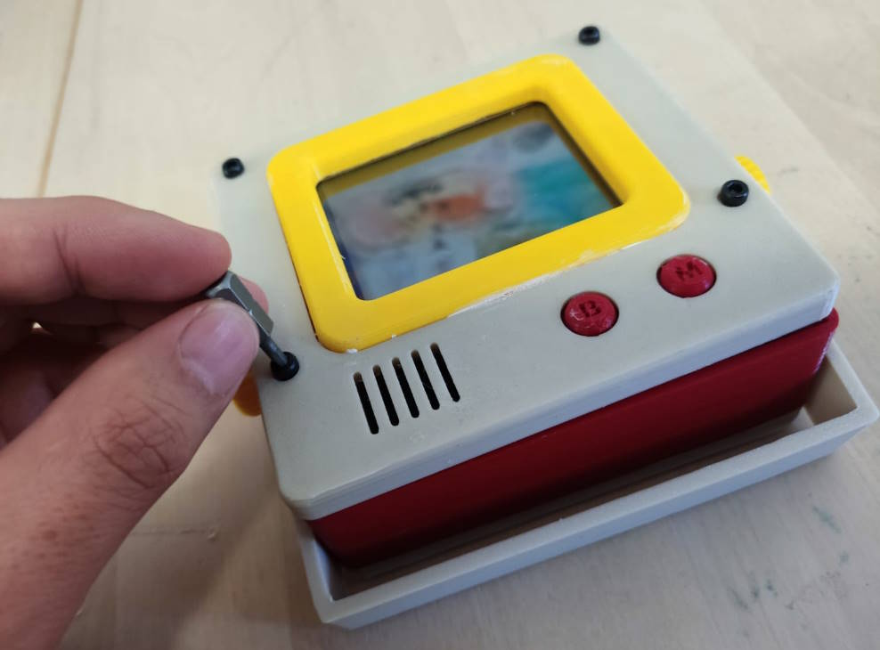

# Quick Start Guide

# Diagram

# First things to do

When you receive the writerDeck, you need to first install a battery and SD card. Please, follow the steps below to complete the setup.

# Battery 

writerDeck requires one 18650 3.7V Lithium ion Battery.
This is not AA battery or AAA battery. 
Please, note that when buying the battery, please buy from a well known brand. One of the tip when buying the battery is to look for maximum capacity. It should *NOT* be higher than 3300 mAh. There are no such battery with this form factor that has higher capacity that 3300 mAh, so, be careful and note this number when buying a battery.

# SD card

writerDeck taks a SD card. Try to buy lower capacity as possible. If the size is bigger than 32 GB... you need to setup a special partition to make it recognized in the writerDeck. I believe 1GB should be more than enough. 

Some ultra fast sanDisk micro SD cards were not recognized. So, try to buy something not that fancy. 

Make sure to buy the one that has the adapter to the bigger size. writerDeck takes the bigger size SD card.

# Step 1. Open the front cover and install the battery

**PLEASE BE EXTRA CAREFUL TO + and - POLARITY OF THE BATTERY**

Install the battery when the enclosure is open. 

**PLEASE BE EXTRA CAREFUL TO + and - POLARITY OF THE BATTERY**

When installed the battery with the wrong polarity, it can cause a fire.

# Step 2. Prepare SD card

SD card needs to be formatted before inserted into the writerDeck.

Make sure to format the disk with File system **FAT32**

In case FAT32 options are not appearing. You will need to create a partition that is smaller than 32 GB.

Once the SD card is formatted. Put it inside the writerDeck and the writerDeck should be ready.

# Step 3. Google Sync Setup

Please refer to the Build Guide to setup the Google Apps Script. 

https://github.com/unkyulee/micro-journal/blob/main/micro-journal-rev-5-esp32-usbhost/readme.md

# Changing Animation

If you want to change the Startup and Sleep animation. You can place the gif files directly in the SD card. Filename should be exactly the same in order to have the effect. 

* wakeup.gif

Startup animation file. When the device boots. It will play the wakeup.gif

* sleep.gif

When no key press for one minute. Device goes into sleep mode and will play the sleep.gif animation.

* File size 

Width: 320 px \
Height: 240 px

Each file should not exceed 1 MB 

Use the following web site to create your own animation files.

https://ezgif.com/