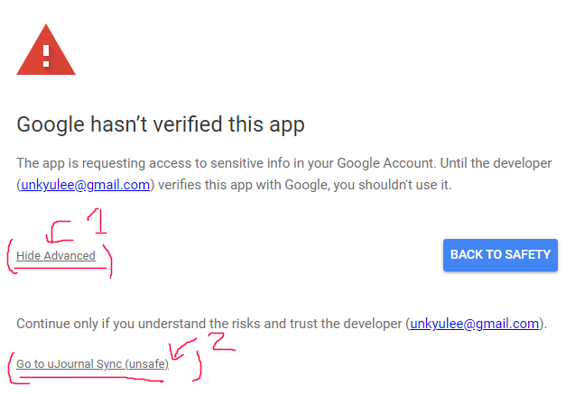

# Quick Start Guide

# Diagram


# First things to do

When you receive the writerDeck, you need to first install a battery and SD card. Please, follow the steps below to complete the setup.

# Battery


writerDeck requires one 18650 3.7V Lithium ion Battery.
This is not AA battery or AAA battery.
Please, note that when buying the battery, please buy from a well known brand. One of the tip when buying the battery is to look for maximum capacity. It should _NOT_ be higher than 3300 mAh. There are no such battery with this form factor that has higher capacity that 3300 mAh, so, be careful and note this number when buying a battery.

# SD card


writerDeck taks a SD card. Try to buy lower capacity as possible. If the size is bigger than 32 GB... you need to setup a special partition to make it recognized in the writerDeck. I believe 1GB should be more than enough.

Some ultra fast sanDisk micro SD cards were not recognized. So, try to buy something not that fancy.

Make sure to buy the one that has the adapter to the bigger size. writerDeck takes the bigger size SD card.

# Step 1. Open the front cover and install the battery


**PLEASE BE EXTRA CAREFUL TO + and - POLARITY OF THE BATTERY**

Install the battery when the enclosure is open.


**PLEASE BE EXTRA CAREFUL TO + and - POLARITY OF THE BATTERY**

When installed the battery with the wrong polarity, it can cause a fire.

# Step 2. Prepare SD card

SD card needs to be formatted before inserted into the writerDeck.


Make sure to format the disk with File system **FAT32**

In case FAT32 options are not appearing. You will need to create a partition that is smaller than 32 GB.

Once the SD card is formatted. Put it inside the writerDeck and the writerDeck should be ready.

# Step 3. Google Sync Setup

## 1. Connect to Google Drive

https://drive.google.com

## 2. Create a folder: "uJournal"


## 3. Go inside the uJournal folder

## 4. Create Google Apps Script


## 5. Copy the Sync Script

Open the following link to get the lastest script code. Open it can copy and paste the code to the apps script. Overwrite what was existing in the apps script before

https://raw.githubusercontent.com/unkyulee/micro-journal/main/micro-journal-rev-4-esp32/install/google/sync.js

Give some name to the apps script project


## 6. Deploy the Apps Script

Click on the "Deploy" button


Choose the deployment type as "Web app"


Configure as the following. Execute as "Me". This will allow the script to access to your drive.

Who has access as "Anyone". This way writerDeck can access to the drive. As long as you don't share the link that is provided. Only the writerDeck should have access to the drive.

## 7. Press "Deploy" on the popup

Wait for a bit, then it will ask you to authorize the app. Choose the account of the google drive.


It will give a scary message while authorizing it. The script that you just copied is not verified. Considering that this script is on your google drive and will access your own google drive, it is ok to press, "go to uJournal Sync".



Allow the Drive access at the next screen. Your account name should appear. (Not mine)


## 8. COPY THE LINK PROVIDED AS WEB APP URL


## 9. Open the SD card of the writerDeck

connect the SD card to the PC and find config.json.
If config.json file doesn't exists. Then create one yourself and paste the copied link in the following section. "sync" -> "url"

(If possible, also setup the WiFi at this point)

```javascript
{
  "sync": {
    "url": "!!!COPY YOUR WEB APP SCRIPT URL HERE!!!!!"
  },
  "network": {
    "type": "wifi",
    "access_points": [
      {
        "ssid": "WIFI ACCESS POINT NAME",
        "password": "WIFI KEY"
      }
    ]
  }

}

```

Save the sd card. Safely remove the card from the PC and then you should have your Google Sync working.

While you are on the writerDeck. Press "ESC" on the keyboard then press S to see if it is working.

# USB Keyboard

Most of the USB keyboard should work by connecting to the writerDeck.

- Bluetooth keyboard is not able to connect to the writerDeck. (Should be possible in the future development)
- Wireless keyboard with 2.4 Ghz USB dongle should work
- Wired USB keyboard should work
- Some keyboards that has USB Hub on board may not work.

# Changing Animation

If you want to change the Startup and Sleep animation. You can place the gif files directly in the SD card. Filename should be exactly the same in order to have the effect.

- wakeup.gif

Startup animation file. When the device boots. It will play the wakeup.gif

- sleep.gif

When no key press for one minute. Device goes into sleep mode and will play the sleep.gif animation.

- File size

Width: 320 px \
Height: 240 px

Each file should not exceed 1 MB

Use the following web site to create your own animation files.

https://ezgif.com/
