# Distraction-Free writing device: WriterDeck using any USB mechanical keyboard


Introducing a distraction-free writing device powered by ESP32-S3 and featuring a 3-inch display. Simply connect any USB keyboard, and you're ready to start writing. The device comes in a simple enclosure designed to sit neatly next to your keyboard, and it's easily portable for on-the-go use.

# What made you to make the four devices that does the same thing?

Introducing the fourth iteration of writerDeck. In the previous version, I have introduced the ESP32, enabling instant power-on and seamless access to a minimalist writing environment. Personally, I found enjoyment in using this device. On numerous occasions, I simply picked it up and began writing, resulting in rather satisfying texts.

_My previous iteration_

However, it's worth noting that the device features a fixed 30-key keyboard, meticulously tailored to my personal preferences. While the concept was solid and the ESP32 proved to be a fitting solution, the hyper-personalized keyboard layout posed a barrier for others to adopt and use the device.

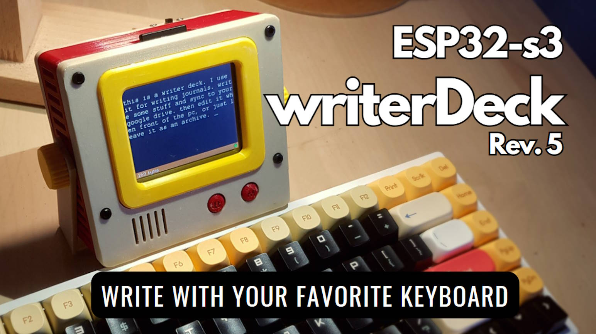_This iteration_

I envisioned the writerDeck as a tool that could benefit a wider audience. However, the fixed keyboard layout posed a significant obstacle to this goal. What if this keyboard component could be separated and offer a USB interface?

Now, any mechanical keyboard with a USB interface can connect to it, opening up possibilities for a broader range of users. Additionally, by utilizing a 2.4 GHz dongle, typing remotely without cables becomes a fascinating option. Inspired by this potential, I began working on implementing these features.

# USB HOST

To receive signals from a USB keyboard, the connecting device must function as a host. A host device is responsible for supplying voltage and current to connected devices, as well as managing the hierarchy of connections, especially when connected via hubs and multiple series of devices.

_Is this the right side?_

While most PCs and smartphones possess USB host functionality natively, allowing keyboards to be plugged in and work seamlessly, the ESP32 operates differently. Unlike PCs and smartphones, the ESP32, particularly the ESP32 Wroom modules, does not inherently support these features. As a result, even if you were to connect a USB keyboard to an ESP32, it would not recognize key presses.

## ESP32 and Soft USB HOST

Initially, I didn't have an ESP32-S3 board on hand. However, during my research, I stumbled upon a repository showcasing a software implementation of USB host functionality for the ESP32. This discovery felt like a breakthrough – problem solved, or so I thought.

The repository, found at https://github.com/tobozo/ESP32-USB-Soft-Host, provided the necessary library for implementing USB host functionality on the ESP32. Excitedly, I integrated the library into my project, wired up a USB female port on the board, and conducted initial tests. To my delight, it worked.

Looking back, I realize I should have conducted more thorough testing at this stage, as I soon encountered unforeseen challenges.

### This keyboard worked with USB SOFT HOST

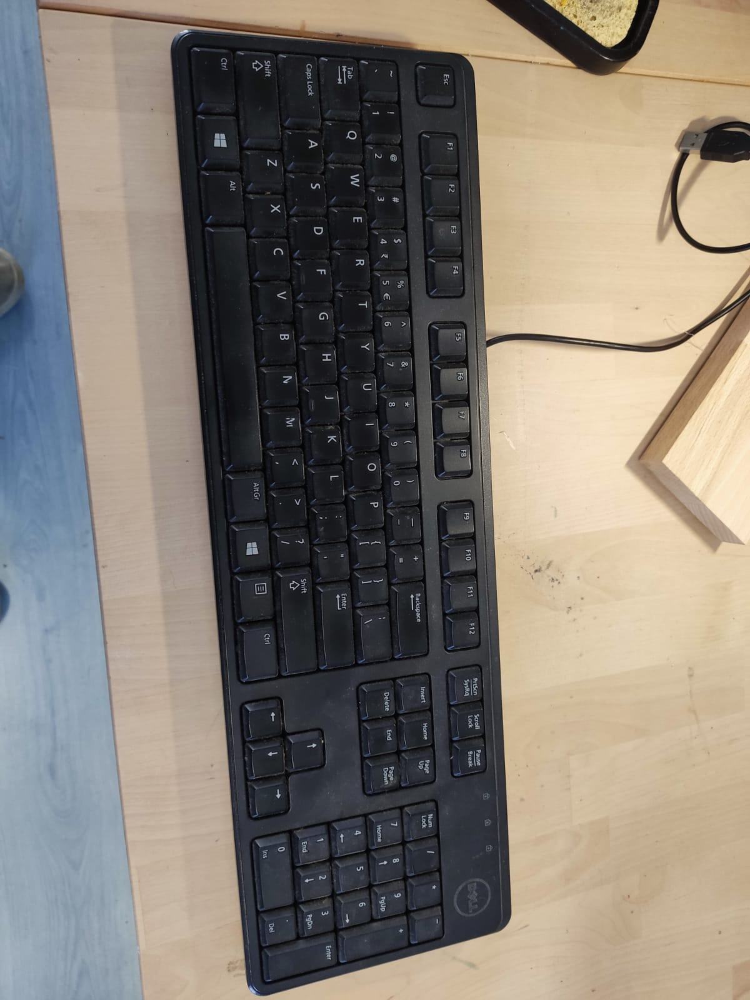

### But this keyboard did not work. It crashed esp32 continuously when connected.

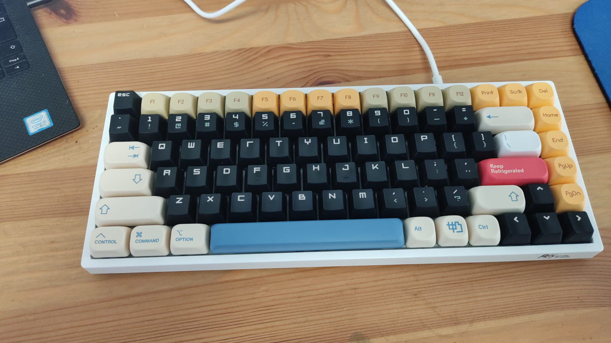

Unfortunately, I only noticed this error after I had already printed the enclosure and finalized the assembly. Excited to put the device to the test, I plugged in my main keyboard into the writerDeck, only to discover that it didn't work at all. It was a devastating realization.

## Software version of USB HOST ONLY works with USB Low Speed

According to the documentation on the ESP32-USB-Soft-Host GitHub repository, the Soft USB Host implementation only supports USB Low Speed, which corresponds to USB 1.0 devices. This limitation became apparent when I discovered that the keyboard that initially worked with the ESP32 Soft USB Host was an older USB 1.0 model. In contrast, the keyboard that didn't work was a USB 2.0 device.

Initially, I misunderstood "USB Low Speed" to simply mean slower devices, rather than being specific to USB 1.0. This led to the realization that the ESP32 Soft USB Host cannot be used with USB 2.0 devices, which are more prevalent nowadays.

Upon realizing this limitation, I decided to purchase an ESP32-S3 devkit board. This required redesigning the enclosure and rewiring the pins to accommodate the new board. Eventually, after these adjustments, it worked.

## ESP32-S3 and Hardware USB HOST

Although the ESP32-S3 boasts native USB host implementation on its hardware base, I encountered challenges when attempting to connect a USB keyboard directly. Initially, I wired GPIO 20 to D+ and GPIO 19 to D- of the USB female port, along with connecting VIN and GND to the board as specified.

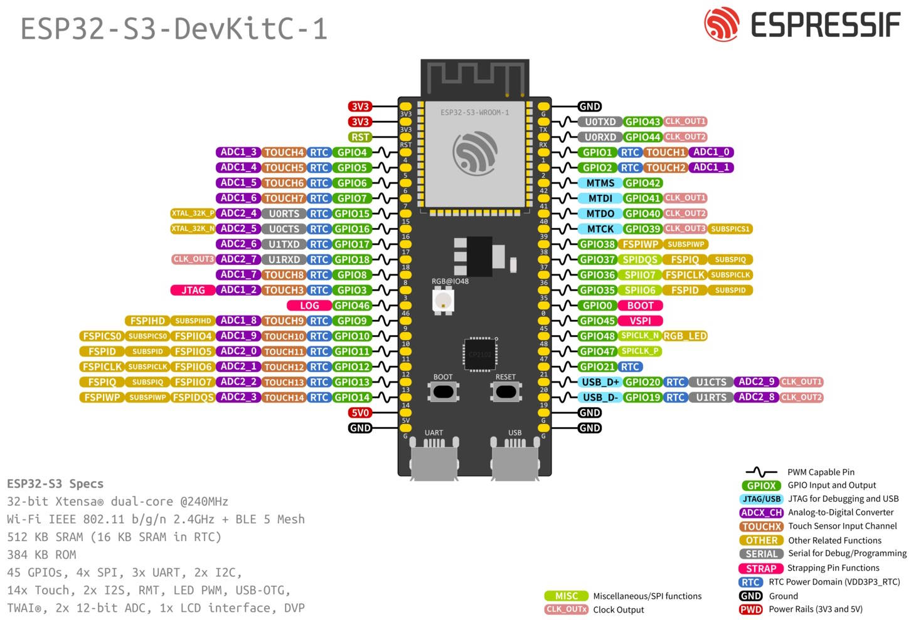

Despite the correct wiring and initialization of USB-related code, the keyboard remained unresponsive. Puzzled by this, I used a voltage measuring tool and discovered that there was no voltage present on the USB connector's VIN and GND pins.


Further investigation revealed that the devkit doesn't supply voltage to the VIN pin; it only receives voltage. This is due to a diode blocking voltage flow. Although it may seem intuitive to connect jumpers to supply voltage, it's crucial not to do so.

**DO NOT connect those jumpers!**

The reason for the default lack of voltage supply is to protect the board from potential damage caused by USB nodes with power requirements exceeding the board's capacity. If a USB device connected to the keyboard, such as LEDs or other power-intensive components, demands excessive power, it could potentially damage the board. Thus, it's advisable to supply power to the USB connector from alternative sources, such as a battery, rather than through the ESP32-S3 board.

Once I supplied power to the USB female connector from an external source, everything started working flawlessly. Keyboard strokes were successfully registered by the ESP32, and all features functioned as expected.

- https://github.com/tanakamasayuki/EspUsbHost
- Credit goes to the respository owner tanakamasayuki and also, **Vince_Gill** who help me to point to the repository. Thanks!

# Build Guide

This document serves as a build guide to assist anyone in constructing this device on their own. I'll provide the steps necessary to achieve this goal. If you find any key information missing, please don't hesitate to reach out to me.

## Component used

- [ESP32 S3 WROOM1 N16R8](https://www.amazon.it/gp/product/B0CLD4QKT1/ref=ppx_yo_dt_b_asin_title_o02_s00?ie=UTF8&psc=1)

Any ESP32-S3 devkit board can be utilized, and there's no necessity for it to be restricted to the specific postfix N16R8. These postfixes specify the flash space and PSRAM. The firmware is designed to operate with ESP32 Wroom boards, which have less flash and RAM, so any choice of S3 boards should suffice.

- [ILI9341 2.8" ILI9341 240 \* 320 TFT LCD Screen](https://www.amazon.it/ILI9341-Display-seriale-Arduino-Raspberry/dp/B07YTWRZGR/ref=sr_1_1?dib=eyJ2IjoiMSJ9.UQY1rH8qtdwW9a5QPrG3Tb0myeb_jE8vdzWnejFGWDF3RMdaKR2OYT2rD4zTsk5tRCPYmq4ARJ2DOFTW3cxicAmdQunZ0KTyhWrjZR2bVFiKfQjQvtB_BBvMuu2iOIYuM5oSUVJbFG4PloP041StmO_S7FB3SfJmuK9EX6EGx2Dkl0-VV2hkXMS2zlSrDwb7tUdrxbFU4Xl3W1rrLyoCOELgsObCdZHV0HMCGTORkiuCulcPIQpaLsI-kV6qgcPjFT8sMMJxv6foRX9yQPRCQHX4yDZGiHglS-64ot6zReg.JuwwXYaGqgeyWqYPXEaeERt-l1lEKuZ_2eHDJDNbUe4&dib_tag=se&keywords=ili9431&qid=1713525525&sr=8-1)

The display module includes an integrated SD card slot, eliminating the need for an additional SD card module. My 3D design utilizes the SD card slot located in the middle of the board. There are several variations of the ILI9341, so if you plan to use the provided STL files, ensure compatibility by checking dimensions with the linked product.

- [LiPo Charge Controller and 5V output module](https://www.amazon.it/Ouitble-caricabatteria-integrato-scarico-caricabatterie/dp/B09MQ6ND2Q/ref=sr_1_12?crid=8O78303YIA7M&dib=eyJ2IjoiMSJ9.ogstJhP7PWO-g81-wnxKh6VUbIZRJhLdyBc18r5jSRC5YsVWLrFZEKaf5mNfcg3UK9LZdo_N8zQ_iPBbUhlwr3lt_ZKxrB8_a-TVVGLO5m8y3xMHqBYbCl5NF8diqwd4Kg68cxOloVVTeY8NWgio7k0ON1HuFfkIrApVw4revVO-RqwcBmSR8IBHGI2L8TYDwmDItWB_bpQt9TZzSWhU2c5RgGiAslF4rDhHRQsu67HdDcQBRHaJdhroxiRJUNBHL3CnXyxrpiOCMKIH7pG8nBPgcX4mhEASN-Sw3NmjFsQ.qikh6iFDKhjEch8EOAYNdKsQmJk30ucZsf9OFwOfRzg&dib_tag=se&keywords=lipo+charger+module&qid=1711365173&sprefix=lipo+charger+module%2Caps%2C145&sr=8-12)

This is the simplest solution I found for resolving power supply issues for any 5V projects with batteries. It's straightforward and highly versatile for other voltage projects beyond 5V. This module is incredibly useful to have on hand.

- SD Card

I utilized a micro SD card in this project. I noticed that some SanDisk cards were not recognized. It's possible that some high-performance, ultra-fast cards may not have SPI interface compatibility... it's uncertain. It's advisable to purchase a card that is not overly fancy, preferably under 32GB. 1GB should provide more than enough storage.

If you purchase an SD card larger than 32GB, you'll need to create a partition with a maximum size of 32GB due to the ESP32's architectural limitation of being 32-bit, preventing it from reading larger than 32GB.

- Other components. USB-C female adaptor, Push button (6 mm), SPDT position switch, 3 mm threaded inserts and nuts, 2.5 mm machine screws...

## Step 1. Preparing the DISPLAY

Remove the pins soldered on the display board using a nipper. Proceed slowly and gently to avoid scratching the board surface with the tools.


Apply additional solder to the pins, then use the nipper to remove them while melting the solder. Ensure to add extra solder when removing the pins.

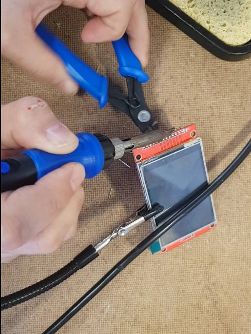

Wire the MOSI, MISO, and CLK (SCK) pins from the SD card side of the pins to the DISPLAY part of the pins. Assign the CS pin of the SD card to the ESP32 board.

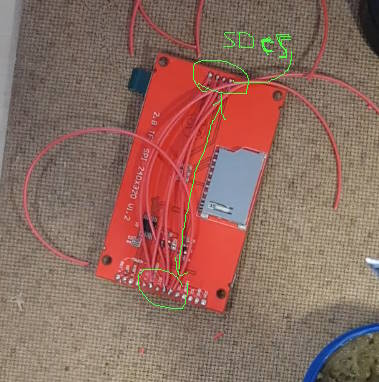

We will utilize the ILI9341 and SD card slot in this module, both utilizing the SPI interface. Therefore, the MOSI, MISO, and CLK pins are shared between the DISPLAY and SD functions.

Expose the following display pins as 10 cm wires from the board, which will later be connected to the ESP32 board:

- MISO
- MOSI
- SCLK
- DC
- RST
- VCC - LED combine these two together
- GND
- CS DISPLAY
- CS SD

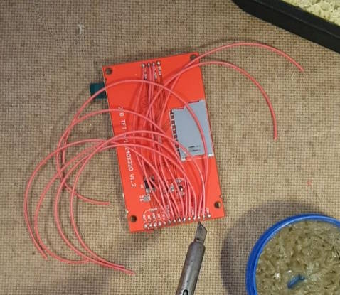

Once done the board should like the picture above.

## Step 2. Power Supply

The power supply wiring revolves around the LiPo charger module.

Connect the OUT port to the position switch and a connector. This connector will supply power to the ESP32.

Connect the IN port to a USB-C female connector. This allows you to use USB-C cables, which are more readily available than micro USB cables these days.

Connect the BATT port to any battery case. In my build, I used an 18650 battery, but you can use any LiPo battery.

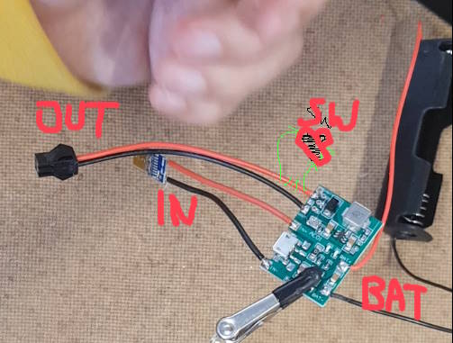

## Step 3. Wiring to ESP32

Solder wires to the ESP32 board according to the pinout.

For VCC and GND, wire them to VIN and GND respectively.

| PIN | PURPOSE                |
| --- | ---------------------- |
| 13  | MISO - SD, DISPLAY     |
| 11  | MOSI - SD              |
| 12  | SCLK - SD, DISPLAY     |
| 46  | DC - DISPLAY           |
| 3   | RST - DISPLAY          |
| 10  | CS - DISPLAY           |
| 9   | CS - SD                |
| 15  | MENU BUTTON (OPTIONAL) |
| 16  | BACK BUTTON (OPTIONAL) |
| 20  | USB D+                 |
| 19  | USB D-                 |
| Vin | USB VCC                |
| 3v3 | DISPLAY VCC            |

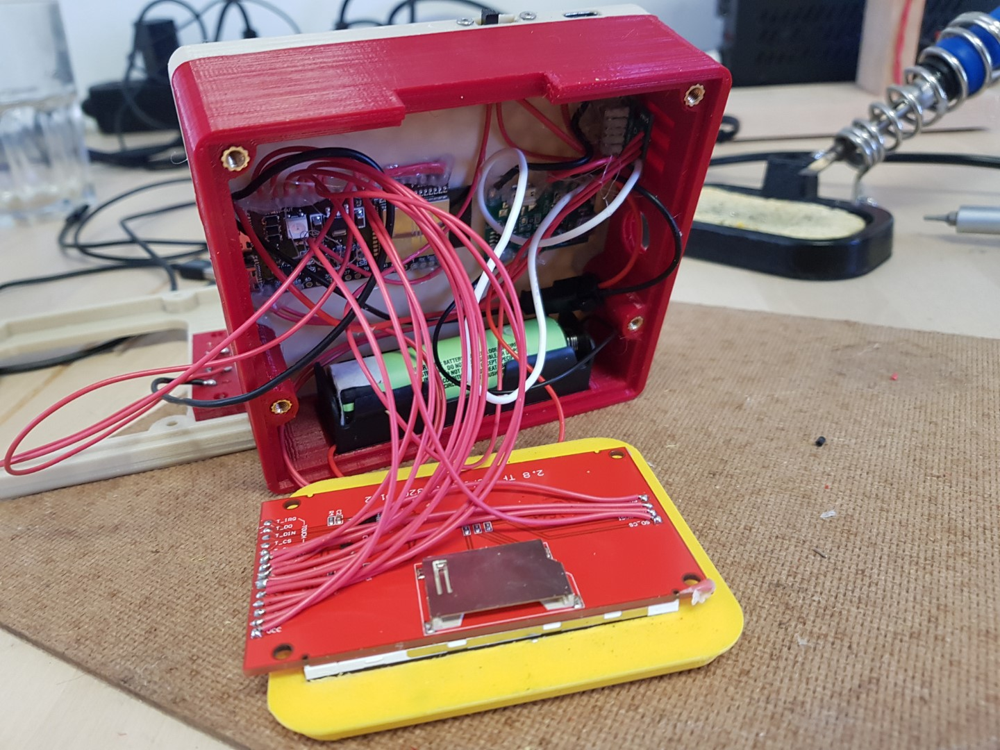

Once the wiring is completed, it may resemble a tangled mess of wires, often referred to as "spaghetti."

## Step 4. Enclosure

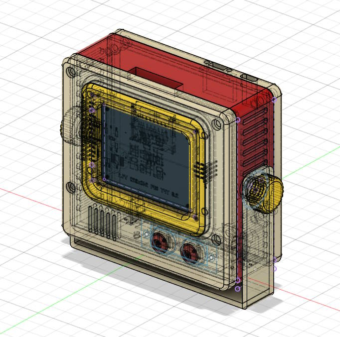

STL files can be found in the folder "STL".

[STL FILES](https://github.com/unkyulee/micro-journal/tree/main/micro-journal-rev-5-esp32-usbhost/STL)

## Step 5. Compile and upload Firmware

The firmware for this iteration utilizes the same codebase as the previous version. To access the project repository for the micro-journal firmware, clone the repository from the following link:

https://github.com/unkyulee/micro-journal.

Once cloned, navigate to the "/micro-journal-rev-4-esp32" folder to find the PlatformIO source project.

To work with the project, open it using Visual Studio with the PlatformIO plugin installed. From there, you'll be able to compile and upload the firmware to the ESP32-S3.

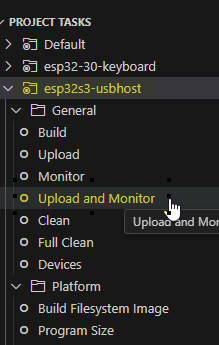

You may need to modify the /src/service/keyboard/usb/usb.cpp file and adjust the usbHost.setHIDLocal() function call to match your keyboard layout.

## Step 6. Setup Google Apps Script for Drive Sync

To enable syncing to your Google Drive, you'll need to install a Google Apps Script on your Google Drive and obtain its URL. The code for the Google Apps Script can be found in the following path:

[/micro-journal-rev-4-esp32/install/google/sync.js](/micro-journal-rev-4-esp32/google/sync.js)

Create a new Google Apps Script document in your Google Drive, then copy the provided code into it. Deploy the script as a web app, which will generate a URL linked to your Google Drive. Place this URL in the "url" field of the config.json file. Once configured, the device should be able to sync files to your Google Drive seamlessly.

## Step 7. Steup SD card for WIFI access

Once all the components are assembled and the SD card is prepared, place a file named "config.json" inside the SD card with the following content:

```config.json
{
  "network": {
    "type": "wifi",
    "access_points": [
      {
        "ssid": "WIFI AP NAME",
        "password": "WIFIPASSWORD"
      }
    ]
  },
  "sync": {
    "url": "Google App Script URL goes here"
  }
}
```

Update the contents of the file with your WiFi connection information. This configuration will be saved on the SD card and utilized when sync is activated.

# Conclusion

My wife and daughter, who've consistently shown indifference to my creations, surprisingly showed a glimmer of interest this time. Perhaps it was the shiny yellow printed parts, or maybe they found the color scheme oddly familiar (Ironman, anyone?). I confessed my feelings to my wife, and since then, she's been trying, albeit hard, to be supportive. But understanding the intricacies of mechanical keyboards and all that jazz seems to be a challenge for her. She's convinced that there might be only three people on Earth who care about keyboards in this way: me, my friend and You.

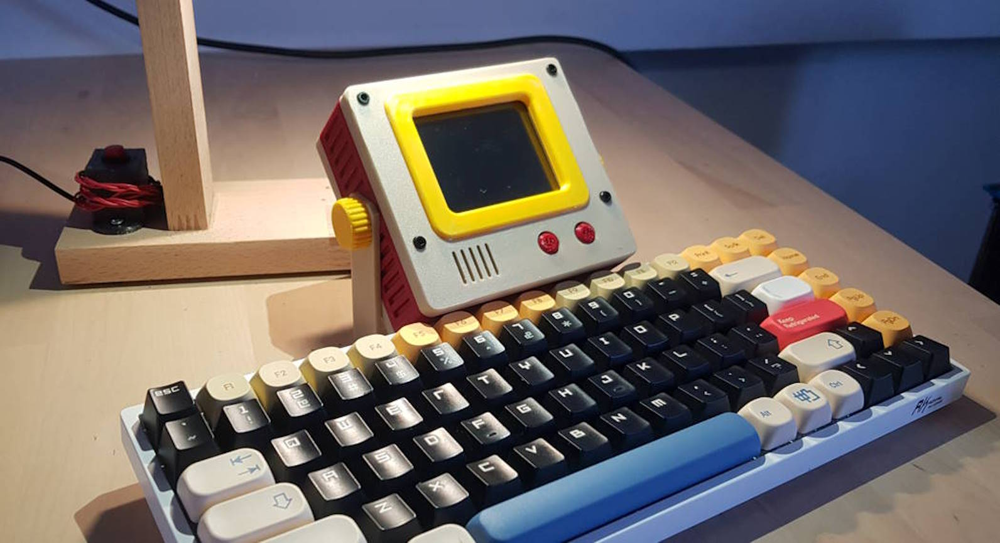

When life feels utterly meaningless, I'll reminisce about this moment—reflecting on the countless hours and energy poured into those iterations. Here I am, at the fifth version, with four physical devices that do nothing but type. I'm left wondering if my future will be any more meaningful than now. Nevertheless, I take solace in seeing the improvements with each iteration and reminding myself that I can (still) solve problems. Or perhaps, did I just create a problem for myself?

# Typing Video

https://youtu.be/zcHL68JWXqc

# Shop

In case if you want me to build this writerDeck for you:

https://www.tindie.com/products/unkyulee/micro-journal-esp32-writerdeck/
