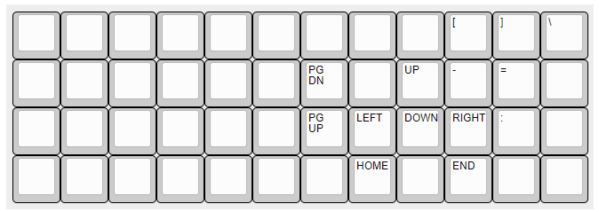
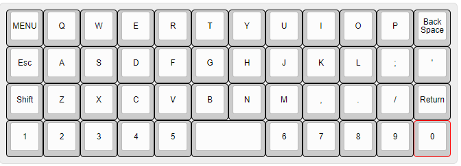

# Is it Really Okay to Use a 48-Key Keyboard?

The Micro Journal Rev. 6 utilizes a 48-key ortholinear keyboard, which may look quite different from the typical office keyboard. Many might wonder how to press the space bar or even if it’s possible to type effectively with it. The usability of this unconventional keyboard can be hard to imagine at first glance.


ALT LAYER


It's true that this keyboard doesn't follow the standard format. Initially, using it can be challenging. However, you'll be amazed at how quickly your brain can adapt to the new system. After just three days of stuttering through typing, you'll start to feel fluent.


# Keyboard Layout Customization Guide

Customizing your keyboard layout is straightforward and involves placing a "keyboard.json" file in the SD card. 

Here's how you can customize your keyboard layout:

1. **Create a "keyboard.json" file inside the SD card.**
2. **Copy the following content into the "keyboard.json" file.**
3. **Turn off the Micro Journal and turn it on again.**
4. **Your customized keyboard layout will now be active.**


The following json is the default configuration. 

```json
{
    "main": 
    [
     "`", "1", "2", "3", "4", "5", "6", "7", "8", "9", "0", ",",
     "ESC", "q", "w", "e", "r", "t", "y", "u", "i", "o", "p", "BACKSPACE",
     "ALT", "a", "s", "d", "f", "g", "h", "j", "k", "l", "\"", "\n",
     "SHIFT", "z", "x", "c", "v", " ", "b", "n", "m", ".", "/", "SHIFT"
    ],

    "main-shift": 
    [
     "~", "!", "@", "#", "$", "%", "^", "&", "*", "(", ")", "<",
     "ESC", "Q", "W", "E", "R", "T", "Y", "U", "I", "O", "P", 127,
     "ALT", "A", "S", "D", "F", "G", "H", "J", "K", "L", "\"", "\n",
     "SHIFT", "Z", "X", "C", "V", " ", "B", "N", "M", ">", "?", "SHIFT"
    ],

    "alt": 
    [
     "`", "1", "2", "3", "4", "5", "6", "7", "8", "[", "]", "\\",
     "ESC", "q", "w", "e", "r", "t", "y", "u", "i", "-", "=", 127,
     "ALT", "a", "s", "d", "f", "g", "h", "j", "k", "l", ";", "\n",
     "SHIFT", "z", "x", "c", "v", " ", "b", "n", "m", ",", "/", "SHIFT"
    ],

    "alt-shift": 
    [
     "~", "!", "@", "#", "$", "%", "^", "&", "*", "{", "}", "|",
     "ESC", "Q", "W", "E", "R", "T", "Y", "U", "I", "_", "+", 127,
     "ALT", "A", "S", "D", "F", "G", "H", "J", "K", "L", ":", "\n",
     "SHIFT", "Z", "X", "C", "V", " ", "B", "N", "M", "<", "?", "SHIFT"
    ]
}
```

- **"main"**: Key pressed without any modifiers (no Shift, no Alt).
- **"main-shift"**: Key pressed while holding the Shift key.
- **"alt"**: Key pressed while holding the Alt key.
- **"alt-shift"**: Key pressed while holding both the Alt and Shift keys.

This configuration allows for a total of 96 keys on the keyboard, and with Shift key combinations, it can extend to around 192 key layouts.

Most keys are typed directly into the JSON file between quotes. However, some keys are special and need specific representations. Here is a list of special keys and their corresponding representations:

| Special Key Written AS | Description                      |
|------------------------|----------------------------------|
| ESC                    | Functions as entering the MENU screen |
| SHIFT                  | This is a SHIFT key              |
| ALT                    | Hidden layer activation key      |
| BACKSPACE              | Works as a backspace             |
| 127                    | Deletes a word (DEL)             |
| \n                     | Enter Key                        |
| \\\\                   | Backslash                        |
| \\"                    | Double Quote                     |

For accented keys, you can't directly write characters like è or ù in the JSON file as they won’t be recognized. Instead, you need to use their DEC values from the ASCII Table, which can be found at [ASCII Code](https://www.ascii-code.com/).

For example:
- È - 200
- è - 232

Example "keyboard.json" content with accents:

```json
{
    "main": 
    [
     "`", "1", "2", "3", "4", "5", "6", "7", "8", "9", "0", ",",
     "ESC", "q", "w", "e", "r", "t", "y", "u", "i", "o", 232, "BACKSPACE",
     "ALT", "a", "s", "d", "f", "g", "h", "j", "k", "l", "\"", "\n",
     "SHIFT", "z", "x", "c", "v", " ", "b", "n", "m", ".", "/", "SHIFT"
    ],

    "main-shift": 
    [
     "~", "!", "@", "#", "$", "%", "^", "&", "*", "(", ")", "<",
     "ESC", "Q", "W", "E", "R", "T", "Y", "U", "I", "O", 200, 127,
     "ALT", "A", "S", "D", "F", "G", "H", "J", "K", "L", "\"", "\n",
     "SHIFT", "Z", "X", "C", "V", " ", "B", "N", "M", ">", "?", "SHIFT"
    ],

    "alt": 
    [
     "`", "1", "2", "3", "4", "5", "6", "7", "8", "[", "]", "\\",
     "ESC", "q", "w", "e", "r", "t", "y", "u", "i", "-", "=", 127,
     "ALT", "a", "s", "d", "f", "g", "h", "j", "k", "l", ";", "\n",
     "SHIFT", "z", "x", "c", "v", " ", "b", "n", "m", ",", "/", "SHIFT"
    ],

    "alt-shift": 
    [
     "~", "!", "@", "#", "$", "%", "^", "&", "*", "{", "}", "|",
     "ESC", "Q", "W", "E", "R", "T", "Y", "U", "I", "_", "+", 127,
     "ALT", "A", "S", "D", "F", "G", "H", "J", "K", "L", ":", "\n",
     "SHIFT", "Z", "X", "C", "V", " ", "B", "N", "M", "<", "?", "SHIFT"
    ]
}
```

In the above example. The key next to the backspace will type è and È respectively. 
Note that it is written in a number and not in the actual character. 

Remember to replace the placeholder values with your desired key configurations. This process enables you to tailor the keyboard layout to your specific needs.


# Keyboard Layout Templates

## QWERTY

For those who want to have the space bar on the bottom, try this layout and use it as a starting point for your customization.



```json
{
    "main": 
    [     
     "ESC", "q", "w", "e", "r", "t", "y", "u", "i", "o", "p", "BACKSPACE",
     "ALT", "a", "s", "d", "f", "g", "h", "j", "k", "l", ";", "'",
     "SHIFT", "z", "x", "c", "v", "b", "n", "m", ",", ".", "/", "\n",
     "1", "2", "3", "4", "5", " ", " ", "6", "7", "8", "9", "0"
    ],

    "main-shift": 
    [     
     "ESC", "Q", "W", "E", "R", "T", "Y", "U", "I", "O", "P", 127,
     "ALT", "A", "S", "D", "F", "G", "H", "J", "K", "L", ":", "\"",
     "SHIFT", "Z", "X", "C", "V", "B", "N", "M", "<", ">", "?", "\n",
     "!", "@", "#", "$", "%", " ", " ", "^", "&", "*", "(", ")"
    ],

    "alt": 
    [     
     "ESC", "q", "w", "e", "r", "t", "y", "u", "i", "-", "=", 127,
     "ALT", "a", "s", "d", "f", "g", "h", "j", "k", "L", ":", "'",
     "SHIFT", "z", "x", "c", "v", "b", "n", "m", "<", ">", "?", "\n",
     "`", "-", "=", "4", "5", " ", " ", "6", "7", "8", "[", "]"
    ],

    "alt-shift": 
    [     
     "ESC", "Q", "W", "E", "R", "T", "Y", "U", "I", "_", "+", 127,
     "ALT", "A", "S", "D", "F", "G", "H", "J", "K", "L", ":", "'",
     "SHIFT", "Z", "X", "C", "V", "B", "N", "M", "<", ">", "?", "\n",
     "~", "_", "+", "$", "%", " ", " ", "^", "&", "*", "{", "}"
    ]
}
```

