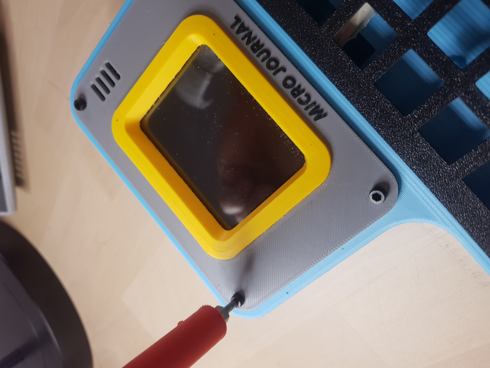
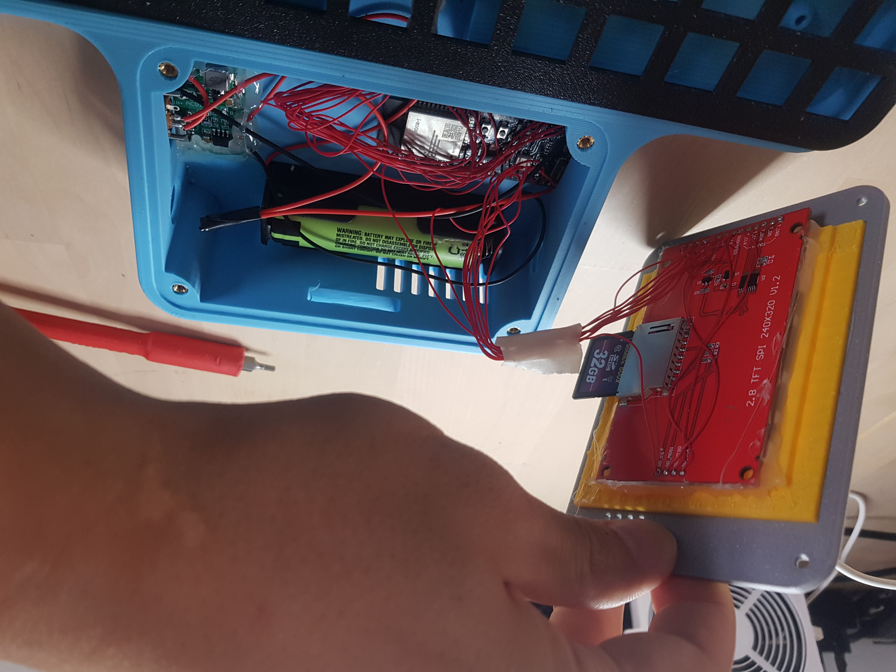
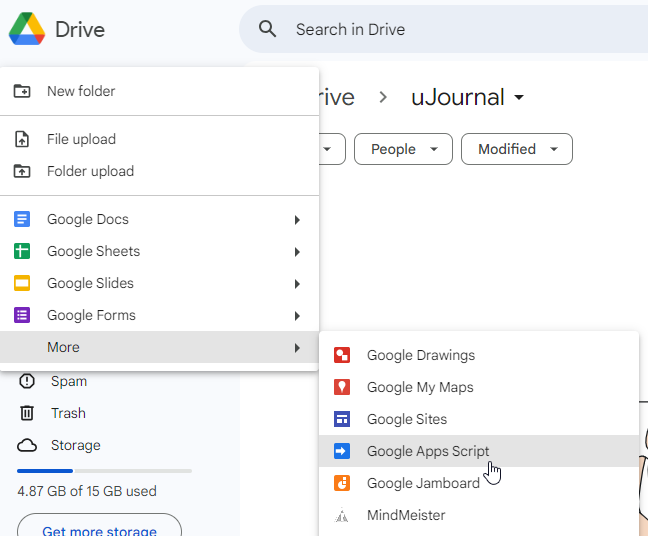

# Quick Start Guide


# First things to do

When you receive the Micro Journal Rev.6, you need to first install a battery. Please, follow the steps below to complete the setup.

If you want to test the device without a battery, plug into the ESP32 UART port (Left-hand side) and the device will run without battery installation. Do not plug the charging cable on the right-hand side without a battery. Can be ok for some time (less than 10 minutes) but not too long without a battery. 

Also, please update the firmware when you receive the device. The firmware on the device is still under development and you may not have the latest releases. You can find the guide how to update the firmware on this document.


# Choosing the Battery


**This is not AA battery or AAA battery.**

**You need to buy your own LIPO battery. LIPO battery is NOT included in the package. EU delivery restrictions prevent batteries in the parcel. The device requires one 18650 battery to operate. Please read the following guide for the choice of your battery**

Micro Journal Rev.6 requires one 18650 3.7V Lithium ion Battery. Search with keyboard "18650" in amazon or any shopping means you have then you should be able to find one. Flat top, button top - either type is fine. 

Please, note that when buying the battery, try to buy from a well known brand. One of the tip when buying the battery is to look for maximum capacity. It should _NOT_ be higher than 3300 mAh. There are no such battery with this form factor that has higher capacity that 3300 mAh, so, be careful and note this number when buying a battery.

Also look for short circuit protection is equipped on the battery. 


# SD CARD

**SD card is included in this Micro Journal Rev. 6. You don't need to buy. Refer to this step only when you need to buy a new one**


Micro Journal Rev.6 takes a SD card. Try to buy lower capacity as possible. If the size is bigger than 32 GB... you need to setup a special partition to make it recognized in the Micro Journal Rev.6. I believe 1 GB should be more than enough. It will takee 8 years of typing to fill it up.

Some ultra fast sanDisk micro SD cards were not recognized. So, try to buy something not that fancy.

Make sure to buy the one that has the adapter to the bigger size. Micro Journal Rev.6 takes the bigger size SD card which is not microSD.


# Step 1. Open the display panel and install the battery



Unscrew four screws on the display panel. Then very gently lift up the panel and try to place it on top of the keyboard.

**PLEASE BE EXTRA CAREFUL TO + and - POLARITY OF THE BATTERY**

Install the battery when the enclosure is open. Battery holder should have the polarity written on the bottom. Please check carefully before inserting the battery.

The place with the spring on the holder is the negative (-) side. 



**PLEASE BE EXTRA CAREFUL TO + and - POLARITY OF THE BATTERY**

When installed the battery with the wrong polarity, it can cause a unreparable damange to the device.

**Be extra careful with the battery installation. Can cause a fire**

# Step 2. Prepare SD card

**SD card is already setup in this Micro Journal Rev. 6. Refer to this step only when you are inserting a new one**

SD card needs to be formatted before inserted into the Micro Journal Rev.6. Connect the SD card to your computer, and initiate formatting process.


Make sure to format the disk with File system **FAT32**

In case FAT32 options are not appearing. You will need to create a partition that is smaller than 32 GB.

Once the SD card is formatted. Place it inside the Micro Journal Rev.6 and the Micro Journal Rev.6 should be ready.


**WHEN PLACING THE SD CARD. WATCH WITH YOUR OWN EYES WHEN INSERTING IT AND TRY TO INSERT TO THE SLOT WHICH IS DEEP INSIDE THE ENCLOSURE. IF NOT PLACED IT CORRECTLY, IT CAN FALL INSIDE THE ENCLOSURE AND YOU WILL NEED TO REOPEN THE PANEL. TO PICK IT UP**

ask me how I know.


# Step 3. Google Sync Setup

If you already have Google Sync Setup. No need to setup again. You can use the same URL that you have retrieved previously. URL can be found in the config.json file inside the SD card.

## 1. Connect to Google Drive

https://drive.google.com

## 2. Create a folder: "uJournal"


## 3. Go inside the uJournal folder

## 4. Create Google Apps Script



## 5. Copy the Sync Script

Open the following link to get the lastest script code. Open it can copy and paste the code to the apps script. Overwrite what was existing in the apps script before

https://raw.githubusercontent.com/unkyulee/micro-journal/main/micro-journal-rev-4-esp32/install/google/sync.js

Give some name to the apps script project


## 6. Deploy the Apps Script

Click on the "Deploy" button


Choose the deployment type as "Web app"


Configure as the following. Execute as "Me". This will allow the script to access to your drive.


Who has access as "Anyone". This way Micro Journal Rev.6 can access to the drive. As long as you don't share the link that is provided. Only the Micro Journal Rev.6 should have access to the drive.

## 7. Press "Deploy" on the popup

Wait for a bit, then it will ask you to authorize the app. Choose the account of the google drive.


It will give a scary message while authorizing it. The script that you just copied is not verified. Considering that this script is on your google drive and will access your own google drive, it is ok to press, "go to uJournal Sync".


Allow the Drive access at the next screen. Your account name should appear. (Not mine)


## 8. COPY THE LINK PROVIDED AS WEB APP URL


## 9. Open the SD card of the Micro Journal Rev.6

Connect the SD card to the PC and create a file "config.json" \
If the file already exists then no need to create one \
Open the file with a text editor (notepad) from PC. 

If aren't familiar with the JSON format. Then delete the existing content and replace it with the following json. Then edit the following part only. 

!!!COPY YOUR WEB APP URL HERE!!!!!

Make sure to not to remove / add any comma (,) or bracket ({, }) or quotes (") while you are editing. If by any chance, the format gets broken. Start over by removing all texts inside config.json file and copy & paste the following template.

If you are familiar with the JSON format. One thing you need to add is the "sync" property as the root property in the JSON and leave the rest of the property as it is.

```json
{
  "sync": {
    "url": "!!!COPY YOUR WEB APP URL HERE!!!!!"
  }
}
```

Save the file to the sd card. Safely remove the card from the PC and then you place the SD card back to the Micro Journal Rev.6. After that you should have your Google Sync working with the Micro Journal Rev.6.

While you are on the Micro Journal Rev.6. Press "MENU" on the keyboard then press "S" to see if it is working. Make sure to have the wifi information set before the sync.

**NOTE THAT WIFI IS LIMITED TO 2.4 Ghz. ESP32 doesn't support 5 Ghz wifi at this moment**


## 10. Wifi Setup

* Press MENU on the keyboard
* When you see the menu screen press W 
* In the wifi settings page press the number of the slot where you want to place the wifi information
* type in WIFI SSID then press enter
* type in WIFI password then press enter
* wifi information is saved to the device


# Firmware Update

Please, make sure that you have the latest firmware on the device. The firmware is still under a development and your device may have shipped with outdated firmware.

To check the current firmware version. You can press "MENU" on the keyboard.


**!!IF YOU SEE 1.0.0 ON YOUR SCREEN PLEASE UPDATE THE FIRMWARE!!**

## 1. Check latest release

You can check the latest firmware from the following link.

https://github.com/unkyulee/micro-journal/releases

## 2. Download the "firmware_48keys.bin"

Download the file from Assets "firmware_48keys.bin"

## 3. Rename it to "firmware.bin" and copy to the SD card

Turn off the Micro Journal Rev.6. \
Pull out the SD card from the Micro Journal Rev.6. \
Rename "firmware_48keys.bin" to "firmware.bin" \
Copy "firmware.bin" file inside the SD card. \
Put back the SD card to the Micro Journal Rev.6. \
Turn on the Micro Journal Rev.6. \
Micro Journal Rev.6 will show white screen for 10 seconds then automatically boot again to the updated firmware.


# Customizing Start and Sleep Animation

If you want to change the Startup and Sleep animation. You can place the gif files directly in the SD card. Filename should be exactly the same in order to have the effect.

- wakeup.gif

Startup animation file. When the device boots. It will play the wakeup.gif

- sleep.gif

When no key press for one minute. Device goes into sleep mode and will play the sleep.gif animation.

- File size

Width: 320 px \
Height: 240 px

Each file should not exceed 1 MB

Use the following web site to create your own animation files.

https://ezgif.com/


- Example


# Keyboard Layout Customization

Keyboard layout can be customized to fit your needs. Please, refer to [Key Map Customization](./keymap.md).  
